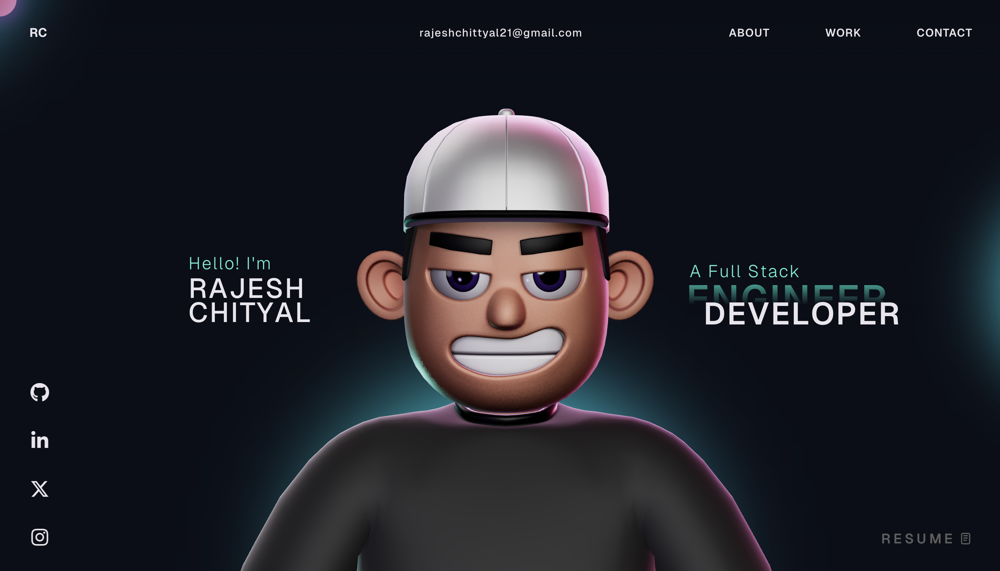

# Zeeshan Portfolio

This repository contains my personal developer portfolio built with React, TypeScript, GSAP, and Three.js.

The site showcases:
- Frontend work with responsive UI and motion-driven interactions
- Backend experience with API and automation workflows
- AI-focused backend capabilities and integrations



## Stack

- React 18
- TypeScript
- Vite
- GSAP (official package)
- Three.js and React Three Fiber
- Rapier physics
- HTML and CSS

## Local Development

1. Install dependencies:

```bash
npm install
```

2. Start the development server:

```bash
npm run dev
```

3. Build for production:

```bash
npm run build
```

4. Preview the production build:

```bash
npm run preview
```

## Scripts

- npm run dev: Run Vite dev server
- npm run build: Run TypeScript build and Vite production build
- npm run lint: Run ESLint
- npm run preview: Preview production build locally

## GSAP Note

This project uses the official gsap package imports.
Reference: https://gsap.com/docs/v3/Installation/

## License

This project is open source and available under the [MIT License](LICENSE).
